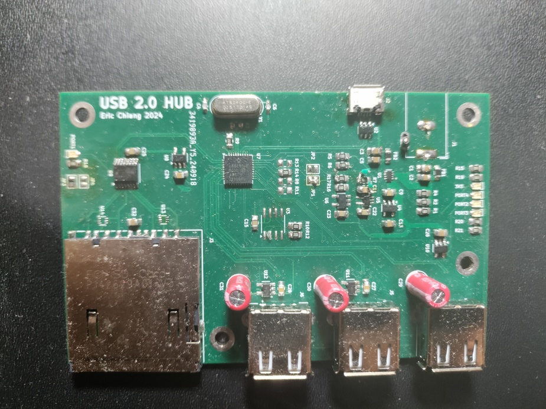

## CHIP-8 Emulator by ericslchiang
### March 18th 2025  

######
An USB 2.0 Hub with three downstream USB 2.0 Ports and one SD card slot. Built using a Microchip USB2514B for USB Hub control and a Genesys Logic GL823K USB 2.0 to SD card converter IC.  
Routed on a 4-layer PCB with controlled impedances and length controlled USB differential routes. All design files in KiCAD. 
